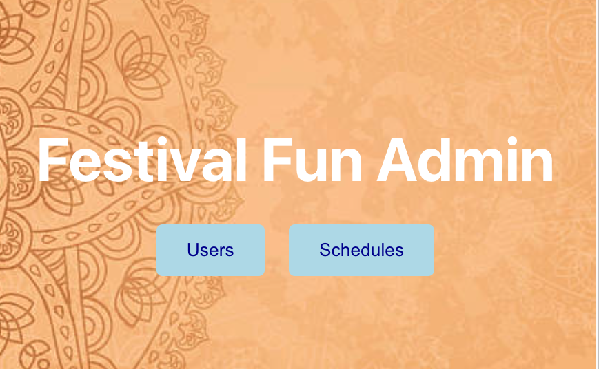

# Festival Fun Frontend

## Description
Festival Fun Frontend is a React-based application designed to provide users with an interactive interface to explore and manage festival-related information. It communicates with the Festival Fun Backend to fetch and display data such as events, schedules, and attendee details.

---

## Table of Contents
- [Installation](#installation)
- [Usage](#usage)
- [Features](#features)
- [Screenshots](#screenshots)
- [Testing](#testing)
- [Contributing](#contributing)
- [License](#license)

---

## Installation

1. **Clone the repository:**
   ```bash
   git clone https://github.com/James-Cochran/festival-fun-fe.git
   ```
2. **Navigate to the project directory:**
   ```bash
   cd festival-fun-fe
   ```
3. **Install dependencies:**
   Ensure you have [Node.js](https://nodejs.org/) installed, then run:
   ```bash
   npm install
   ```

---

## Usage

1. **Start the development server:**
   ```bash
   npm start
   ```
2. **Access the application:**
   Open your browser and navigate to `http://localhost:3001` to interact with the frontend interface.

---

## Features

- **User Listings:** View a comprehensive list of festival users.
- **Schedule Details:** Ability to see all schedules or just a single users schedule.
- **Responsive Design:** Optimized for various screen sizes.

---

## Screenshots




---

## Testing

This project uses Cypress for end-to-end testing. To run the test suite, follow these steps:

1. **Install Cypress:** Ensure dependencies are installed by running:
   ```bash
   npm install
   ```

2. **Run the Cypress test suite:**
   ```bash
   npx cypress open
   ```
   This will open the Cypress Test Runner, where you can run individual or all tests.

3. Alternatively, run tests in headless mode:
   ```bash
   npx cypress run
   ```

For more details on Cypress, refer to the [Cypress documentation](https://docs.cypress.io).

---

## Contributing

- James Cochran - https://github.com/James-Cochran

